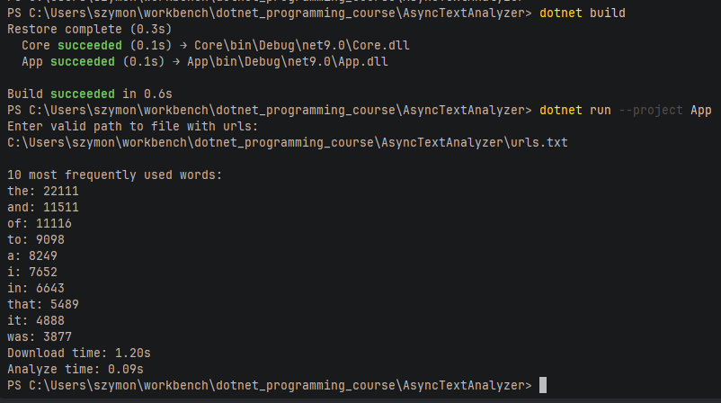

## Async Text Analyzer
#### Small project that downloads books from Project Gutenberg websites and searches for 10 most frequently used words in them

#### Example run

#### Used asynchronous methods:
- Task.Run - this method is used to create thread that does single job given to it as argument. It creates thread and separates it from program's main thread allowing to use asynchronous running.
- lock - this function works like like semaphore, it blocks access to resource shared between different tasks - threads.
- Parallel.ForEach - it anables use of for loops on many threads, it spreads elements of Enumerable between threads allowing operations to run parallel to eachother.
- async - it is used to declare method as asynchronous, it returns Task object that symbolizes future resuilt of the method.
- await - it suspends method until it returns a value, without blocking the thread.