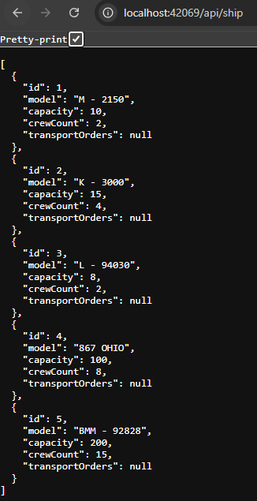

## Space Fleet Rest API

#### How to run?
 - Open command line,
 - Clone repository with "git clone \<repository url>" command,
 - Open project in Jet Brains Rider or Visual Studio,
 - Open console in IDE and type "dotnet run" - dependencies should install and project should build,
 - Enter favorite browser and go to localhost:42069/swagger/index.html to test it out.

#### What is this API?
It's mini project for my dotnet programming classes. It's REST API created in .NET. It consists of couple layers:
- Models - which are classes representing tables in database,
- Data - which creates database context,
- Services - which create and validate new entities,
- Controllers - which connect services and their methods to appropriate endpoints.
- Tests - self explanatory.

#### After putting some data into SQLite DB and entering correct url we can see json response to get request

#### Correct get endpoints in my api are:
- api/Pilot or api/Pilot/\<id>
- api/Destination or api/Destination/\<id>
- api/Ship or api/Ship/\<id
- api/TransportOrder or api/TransportOrder/\<id>