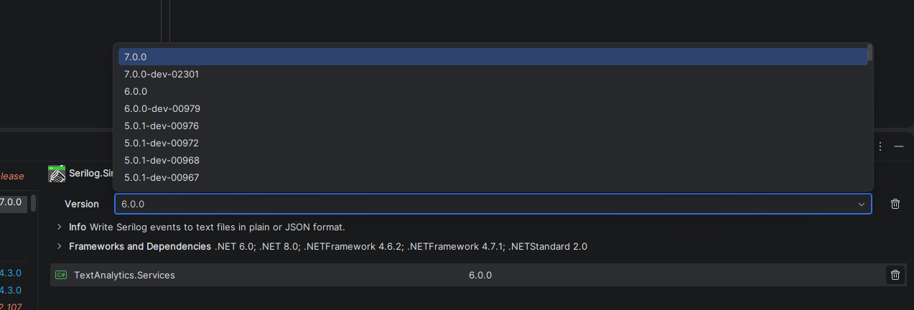
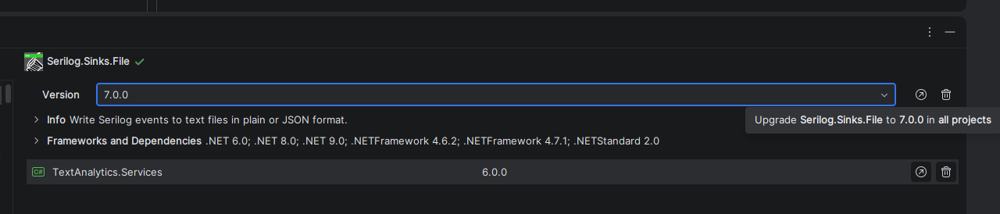
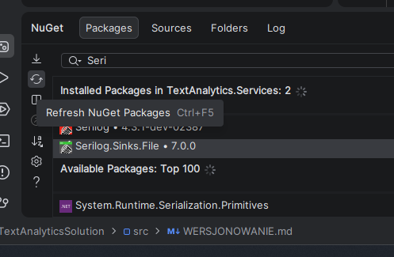

1. W tym miejscu można wybrać wersje poszczególnych pakietów a następnie je zaktualizować.
Następnie po lewej stronie ekranu można odświerzyć paczki w NuGet.

2. SemVer - Semantic versioning, wersjonowanie semantyczne to sposób wersjonowania programu, w którym wersje zapisuje
się trzema numerami: X.Y.Z
 - X - Major - ten numer zwiększa się gdy nowsza wersja przestanie być kompatybilna ze starszymi.
 - Y - Minor - ten numer zwiększa się gdy aktualizacja będzie nadal kompatybilna wstecz.
 - Z - Patch - ten numer zwiększa się gdy wprowadzono kompatybilne wstecz poprawki.